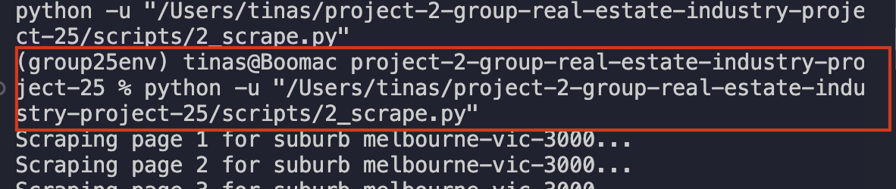
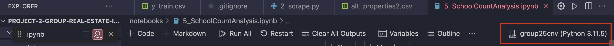

# Real Estate Rental Prices Prediction in Victoria, Australia

This guide will walk you through setting up, running, and understanding the project to analyze real estate data using location-based analysis, data scraping, and predictive modeling.

## Table of Contents
1. [Clone the Repository](#1-clone-the-repository)
2. [Set Up a Python Virtual Environment (Recommended)](#2-set-up-a-python-virtual-environment-recommended)
3. [Install Dependencies](#3-install-dependencies)
4. [Obtain an API Key](#4-obtain-an-api-key)
5. [Data Collection](#5-data-collection)
6. [Data Scraping](#6-data-scraping)
7. [Data Preprocessing](#7-data-preprocessing)
8. [Exploratory Data Analysis (EDA)](#8-exploratory-data-analysis-eda)
9. [School Count Analysis](#9-school-count-analysis)
10. [Feature Selection](#10-feature-selection)
11. [Model Building and Evaluation](#11-model-building-and-evaluation)

<span style="color:red">Refer to the [Debugging Notes](https://docs.google.com/document/d/1ZG4e5yGeJs5okkPj9j3ZS71zCII-B25ysQY466xIou8/edit?usp=sharing) for any encountered bugs.</span>

**Ensure that when using a virtual environment, the dependencies are downloaded to the virtual environment. Also, make sure that you are in the right directory if using your device's terminal.**

**Preferably, all the installation and activation of environment should be done in the terminal of your IDE.**



**If running code of jupyter notebook, make sure you are using the right kernel -> <group25env> if using our recommended virtual environment.**



## 1. Clone the Repository

First, open your terminal **in your IDE terminal** and run the following commands to clone the project repository and navigate into the project directory:

```bash
git clone https://github.com/MAST30034-AppliedDataScience/project-2-group-real-estate-industry-project-25.git
cd project-2-group-real-estate-industry-project-25
```

## 2. Set Up a Python Virtual Environment (Recommended)
Setting up a virtual environment ensures that your project dependencies are isolated from other Python projects on your system.

1. Create a virtual environment (you can replace group25env with any name you prefer):
``` bash
conda create -n group25env python=3.11.5
```

2. Activate the virtual environment:

  ``` bash
  conda activate group25env
  ```


After activating, your terminal should show the virtual environment's name, like (group25env).


## 3. Install Dependencies

Install the required Python packages by running:

```bash
pip install -r requirements.txt
```

## 4. Obtain an API Key

To use the OpenRouteService API for location-based analysis, follow these steps:

1. Sign up or log in to [OpenRouteService (OSM)](https://openrouteservice.org/dev/#/login) and generate an API key.

## 5. Data Collection

Navigate to the `notebooks` directory and run the `1_DataCollecting.ipynb` to fetch external datasets:

* Run all cells to download datasets and generate a list of target suburbs for further analysis.

## 6. API Key Insertion
1. In the project directory, go to the `config` folder.
2. Open the `api_key.txt` file (create one if it doesn't exist) and paste your OpenRouteService API key into the file.
3. Ensure no extra characters or newline.

## 7. Data Scraping

To collect property data from Domain.com.au, run the `2_scrape.py` located in the `scripts` folder. 

**! To ensure that the script runs smoothly, run the script by pressing the run button in VSCode**


**Note:** The data scraping process may take 30-40 minutes, depending on your machine. For example, an M2 MacBook Air (8GB RAM) takes approximately 40 minutes.


## 8. Data Preprocessing

Preprocess the collected data to prepare it for analysis. Run the `3_Preprocessing.ipynb` and make sure to insert your OpenRouteService API key when prompted:

* This step includes cleaning the data, handling missing values, converting categorical data, and addressing outliers.

## 9. Exploratory Data Analysis (EDA)

To gain insights into the dataset, open and run the `4_EDA.ipynb`:

* This notebook provides visualizations, feature distributions, and insights into the significance of various columns.

## 10. School Count Analysis

To analyze the impact of nearby schools on property prices, run the `5_SchoolCountAnalysis.ipynb`:

* This notebook aggregates nearby school counts and creates a feature that captures the number of schools within a 2km radius for each property.

## 11. Feature Selection

Feature engineering and selection are critical for model building. Use the following notebook - `6_FeatureSelections.ipynb`to perform feature scaling, one-hot encoding, KNN imputation, PCA, and mutual information analysis:


## 12. Model Building and Evaluation

To construct predictive models, open and run the `7_ModelBuilding.ipynb`:

* This notebook covers the creation and evaluation of various models, including simple regression models, stacked models, and deep learning approaches.

## 13. Summary Notebook (For the 3 big question)

To view our findings and insights, run `(BONUS)summary.ipynb`